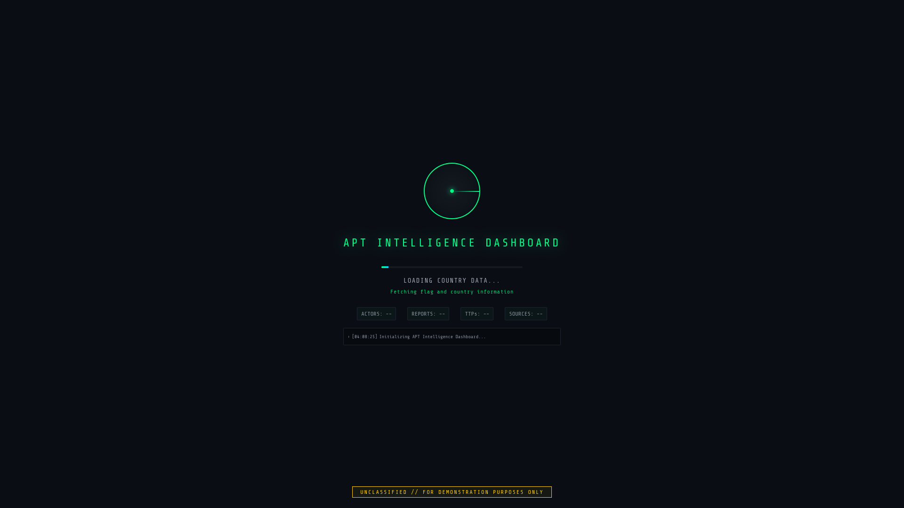
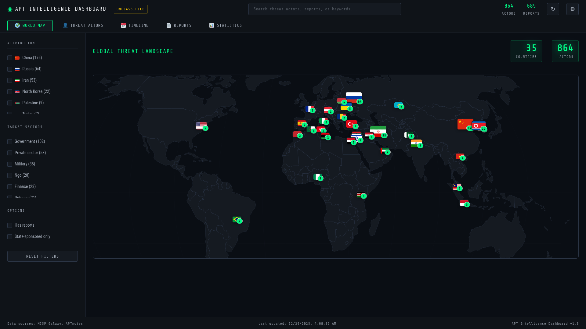
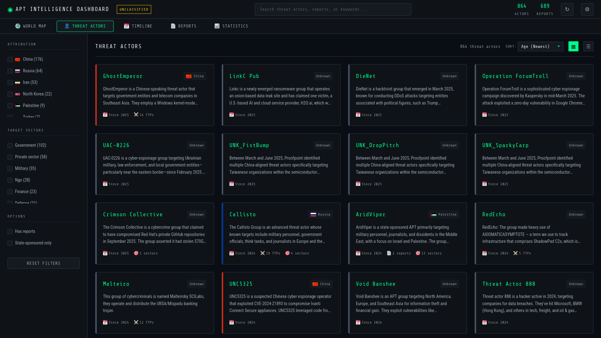
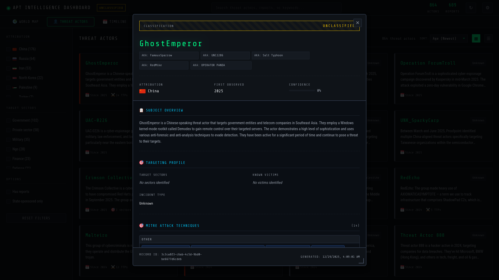
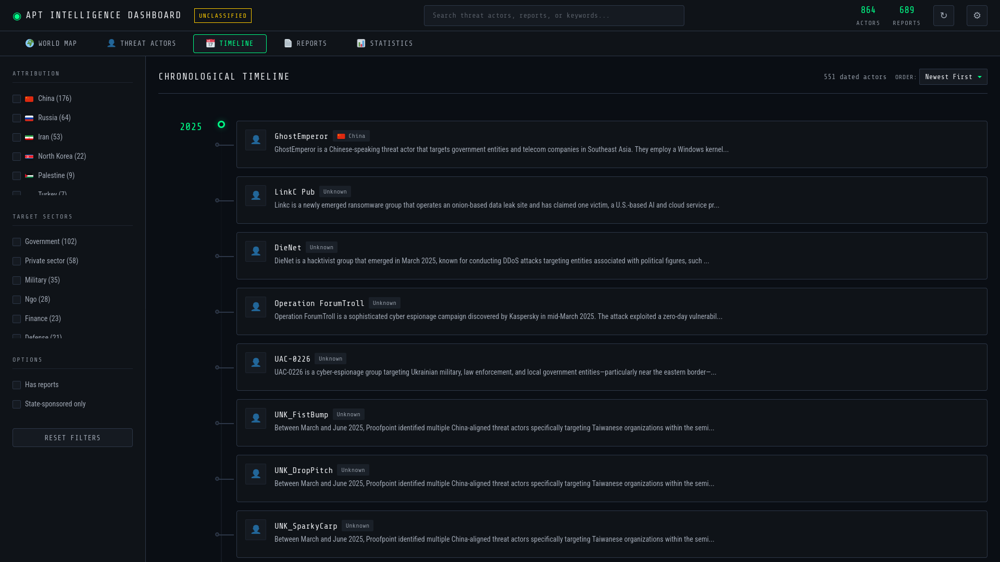
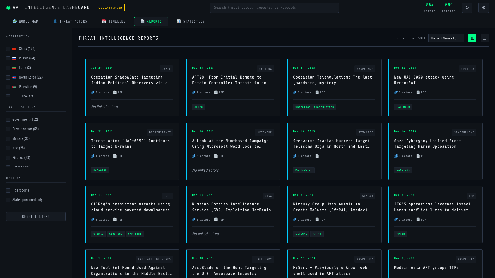
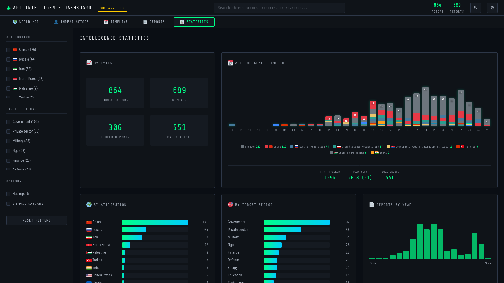

# APT Intelligence Dashboard

<p align="center">
  
</p>

<p align="center">
  <strong>A real-time threat intelligence dashboard that aggregates, normalizes, and visualizes Advanced Persistent Threat (APT) group data from multiple authoritative sources.</strong>
</p>

<p align="center">
  
  
  
  
  
</p>

---

## 🎯 Overview

The APT Intelligence Dashboard provides security researchers, threat analysts, and SOC teams with a unified view of global APT activity. It fetches live data from multiple threat intelligence sources and presents it through an interactive, military-style interface.

### Key Features

- **🌐 Global Threat Map** - Interactive world map showing APT groups by country of origin
- **📊 Timeline View** - Chronological visualization of APT emergence (1990-present)
- **📄 Intelligence Reports** - 689+ linked threat intelligence reports from APTnotes
- **🎯 MITRE ATT&CK Integration** - TTPs mapped to each threat actor
- **🔍 Advanced Search** - Search across 864+ threat actors and aliases
- **📱 Responsive Design** - Works on desktop and mobile devices
- **⚡ Fast Startup** - Progressive loading with background data enrichment

---

## 📸 Screenshots

### Loading Screen
*Progressive data loading with real-time status updates*



### Global Threat Landscape
*Interactive world map showing APT distribution by country of origin*



### Threat Actors Grid
*Browse 864+ threat actors with search and filtering*



### Actor Dossier
*Detailed intelligence dossier with attribution and TTPs*



### Chronological Timeline
*Visual timeline of APT emergence from 1990 to present*



### Intelligence Reports
*689+ linked threat intelligence reports with PDF access*



### Statistics Dashboard
*Aggregate analytics and threat landscape metrics*



---

## 📡 Data Sources

All data is fetched **live from the internet** - no local data files required:

| Source | Data Provided | Update Frequency |
|--------|---------------|------------------|
| [MISP Galaxy](https://github.com/MISP/misp-galaxy) | 864 threat actors, aliases, descriptions | Daily |
| [APTnotes](https://github.com/aptnotes/data) | 689 intelligence reports (PDFs) | Weekly |
| [MITRE ATT&CK](https://github.com/mitre-attack/attack-stix-data) | TTPs, techniques, software | Monthly |
| [ETDA Thailand](https://apt.etda.or.th) | Timeline data, first/last seen dates | Live |
| [Malpedia](https://malpedia.caad.fkie.fraunhofer.de) | Malware families, aliases | Live |
| [Google Cloud Threat Intel](https://cloud.google.com/security) | APT enrichment data | Live |
| [APTMalware](https://github.com/cyber-research/APTMalware) | IOC samples, hashes | Weekly |

---

## 🚀 Quick Start

### Option 1: Direct File Access
Simply open `index.html` in your browser. The dashboard will work in offline mode with cached data.

### Option 2: Local HTTP Server (Recommended)
For full functionality including live data fetching:

```bash
# Using Python
cd apt-intelligence-dashboard
python -m http.server 8000

# Then open http://localhost:8000 in your browser
```

### Option 3: Any Web Server
Deploy the files to any static web hosting (GitHub Pages, Netlify, Vercel, Apache, Nginx, etc.)

---

## 📁 Project Structure

```
apt-intelligence-dashboard/
├── index.html              # Main entry point
├── css/
│   ├── main.css            # Primary styles and variables
│   ├── animations.css      # Animations and transitions
│   ├── dossier.css         # Actor detail modal styles
│   ├── timeline.css        # Timeline view styles
│   ├── worldmap.css        # Map view styles
│   └── print.css           # Print-friendly styles
└── js/
    ├── app.js              # Main application logic
    ├── environment.js      # Environment detection
    ├── storageManager.js   # Local caching (IndexedDB)
    ├── errorHandler.js     # Error handling
    ├── debug.js            # Debug utilities
    ├── focusTrap.js        # Accessibility - focus management
    ├── keyboardShortcuts.js # Keyboard navigation
    ├── a11yAnnouncer.js    # Screen reader support
    ├── data/
    │   ├── dataLoader.js       # Fetches from GitHub sources
    │   ├── dataNormalizer.js   # Merges multi-source data
    │   ├── nameNormalizer.js   # Standardizes actor names
    │   ├── actorParser.js      # Parses MISP Galaxy data
    │   ├── mitreAdapter.js     # MITRE ATT&CK integration
    │   ├── countryData.js      # Country flags and coordinates
    │   ├── etdaParser.js       # ETDA Thailand parser
    │   ├── malpediaParser.js   # Malpedia parser
    │   ├── googleAptParser.js  # Google Cloud APT parser
    │   ├── aptMalwareParser.js # Malware IOC parser
    │   ├── liveDataFetcher.js  # Live data enrichment
    │   └── breachHQParser.js   # Breach data parser
    ├── ui/
    │   ├── worldMap.js         # D3.js world map
    │   ├── timeline.js         # Timeline rendering
    │   ├── dashboard.js        # Grid view
    │   ├── dossierView.js      # Actor detail modal
    │   └── actorCard.js        # Actor card component
    └── utils/
        ├── helpers.js          # Utility functions
        └── search.js           # Search functionality
```

---

## 🖥️ Views

### 1. Threat Actors (Grid View)
Browse all 864+ threat actors in a searchable, filterable grid. Each card shows:
- Actor name and country flag
- Brief description
- First seen date
- Number of linked reports
- MITRE technique count

### 2. Global Threat Landscape (Map View)
Interactive world map powered by D3.js showing:
- APT groups positioned by country of origin
- Click flags to filter by country
- Hover for actor counts
- Zoom and pan support

### 3. Chronological Timeline
Visual timeline from 1990 to present showing:
- When each APT group first emerged
- Color-coded by country attribution
- Stacked bar chart showing emergence patterns

### 4. Intelligence Reports
Browse 689+ threat intelligence reports:
- Linked to relevant APT groups
- Sortable by date, source, or actor count
- Direct PDF download links
- Click to see report details and all linked actors

### 5. Statistics
Aggregate statistics including:
- Top 10 countries by APT count
- Sector targeting breakdown
- Timeline emergence chart
- Report distribution

---

## 🔐 Actor Dossier

Click any actor to open a detailed intelligence dossier showing:
- **Attribution** - Country, state sponsor, confidence level
- **Timeline** - First seen and last seen dates with source
- **Targeting** - Sectors and victim countries
- **MITRE ATT&CK Techniques** - Grouped by tactic (kill chain)
- **Attack Vectors** - Known TTPs from Google Threat Intel
- **Associated Malware** - Malware families used
- **Malware IOCs** - Sample hashes from APTMalware
- **Intelligence Reports** - Linked research papers
- **External References** - Source links
- **Related Actors** - Connected threat groups

Each data field shows its **source** on hover (e.g., "📡 ETDA Thailand").

---

## ⌨️ Keyboard Shortcuts

| Key | Action |
|-----|--------|
| `/` or `Ctrl+K` | Focus search |
| `Escape` | Close modal / Clear search |
| `1-5` | Switch views |
| `?` | Show keyboard shortcuts |

---

## 🌐 Browser Support

- Chrome 90+ ✅
- Firefox 88+ ✅
- Safari 14+ ✅
- Edge 90+ ✅

---

## 📊 Data Caching

The dashboard uses intelligent caching:
- **IndexedDB** for large datasets (when running via HTTP)
- **Memory storage** as fallback (file:// protocol)
- **24-hour cache** for GitHub sources
- **7-day cache** for MITRE ATT&CK (large file)

---

## 🔧 Configuration

No configuration required. The dashboard auto-detects:
- `file://` protocol → Offline mode with cached data
- `http://` protocol → Full live data fetching

---

## 📝 License

MIT License - See [LICENSE](LICENSE) file for details.

---

## 🙏 Acknowledgments

This project aggregates data from these excellent threat intelligence resources:
- [MISP Project](https://www.misp-project.org/) - Malware Information Sharing Platform
- [MITRE ATT&CK®](https://attack.mitre.org/) - Adversary Tactics and Techniques
- [APTnotes](https://github.com/aptnotes/data) - Intelligence report collection
- [ETDA Thailand](https://apt.etda.or.th/) - APT group database
- [Malpedia](https://malpedia.caad.fkie.fraunhofer.de/) - Malware encyclopedia
- [Google Cloud Security](https://cloud.google.com/security) - Threat intelligence

---

## ⚠️ Disclaimer

This dashboard is for **educational and research purposes only**. The threat intelligence data is aggregated from public sources and may contain inaccuracies. Always verify information through official channels before making security decisions.

---

<p align="center">
  <strong>Built with ❤️ for the threat intelligence community</strong>
</p>
